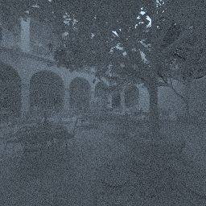
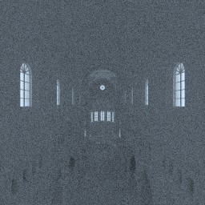
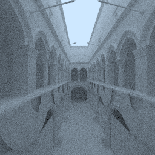

`cuda-lbvh` is a CUDA implementation of a linear bounding volume hierarchy
(LBVH) as described by Karras (see cite below). The LBVH is designed to allow
for a very quick build, as the tree can be built in parallel. To demonstrate its
performance, naive path tracing is performed on three different scenes. Although
offline rendering of static geometry is not the use case of the LBVH, this
allows for a simple illustration of its performance.

## Performance

The table below lists the construction time and the rendering time for three
scenes, each with a one megapixel resolution and a path length of up to 80
bounces. The rendering time is the average of 128 samples. Note that the images
are thumbnails, full resolution images can be found in `doc`.

| Scene        | Triangle count  | Build time  | Trace time  | Image                         |
|--------------|-----------------|-------------|-------------|-------------------------------|
| `sanmiguel`  | 9.963.191       | 0.1429s     | 3.1695s     |   |
| `sibenik`    | 73.564          | 0.0022s     | 0.4071s     |     |
| `sponza`     | 262.267         | 0.0063s     | 0.7160s     |      |

## System requirements and dependencies

Building requires MSVC 2019. The following third-party dependencies are
included:

* [stb](https://github.com/nothings/stb) for writing PNG files.
* `sutil` from the [OptiX](https://developer.nvidia.com/optix) SDK samples for
  random number generation and vector- and matrix math.
* Morgan McGuire's [Computer Graphics Archive](https://casual-effects.com/data)
  for the scenes: Sponza, San Miguel, and Sibenik Cathedral. The `.obj` files
  are edited by triangulating faces.
* [CUB](https://nvlabs.github.io/cub/) is used to perform a radix sort.

## Resources

See [cuda-sdf](https://github.com/nolmoonen/cuda-sdf) for details on path
tracing.

* _Maximizing Parallelism in the Construction of BVHs, Octrees, and k-d Trees_  
  Karras,
  T. [[link]](https://research.nvidia.com/publication/maximizing-parallelism-construction-bvhs-octrees-and-k-d-trees)  
  Introduces a fast construction method for LBVHs on the GPU.
* _Thinking Parallel, Part II: Tree Traversal on the GPU_  
  Karras,
  T. [[link]](https://developer.nvidia.com/blog/thinking-parallel-part-ii-tree-traversal-gpu/)  
  Explains parallel BVH traversal.
* _Thinking Parallel, Part III: Tree Construction on the GPU_  
  Karras,
  T. [[link]](https://developer.nvidia.com/blog/thinking-parallel-part-iii-tree-construction-gpu/)  
  Explains parallel BVH construction.